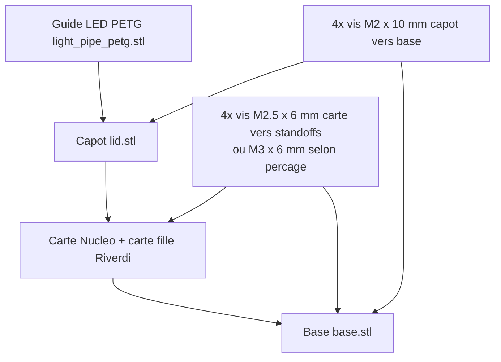

# Manuel d'assemblage

Ce manuel decrit l'assemblage du boitier:

- base: `base.stl`
- capot: `lid.stl`
- guide LED translucide: `light_pipe_petg.stl`

Le boitier est ferme (sans aeration) et conserve l'acces USB, ecran et boutons.

## 1) Schemas illustratifs

### 1.1 Vue eclatee simplifiee

### 1.2 Ordre d'assemblage

## 2) Visserie et quincaillerie

### Fermeture capot -> base

- 4x vis M2 x 10 mm
- Tete recommandee: cylindrique 6 pans creux (DIN 912) ou tete bombee (ISO 7380)
- Filetage: pas standard M2 (0.4 mm)
- 4x inserts thermiques M2 pour la base
  - OD conseille: 3.2 a 3.5 mm
  - longueur insert: 3 a 4 mm

### Fixation carte sur standoffs

- Option A (par defaut du modele): 4x vis M2.5 x 6 mm (trou de passage `standoff_screw_clear_d = 2.8`)
- Option B: 4x vis M3 x 6 mm (si vous augmentez `standoff_screw_clear_d` vers 3.2)
- Tete recommandee: DIN 912 ou ISO 7380

### Guide LED

- 1x piece imprimee en PETG translucide: `light_pipe_petg.stl`
- Montage sans vis (emmanchement dans le capot)

## 3) Procedure detaillee

1. Nettoyer les pieces imprimees.
2. Inserer les 4 inserts thermiques M2 dans les piliers de la base.
3. Poser l'ensemble Nucleo + Riverdi sur les standoffs.
4. Fixer la carte avec 4 vis M2.5 x 6 mm (ou M3 x 6 mm selon adaptation).
5. Verifier l'alignement USB avec les ouvertures laterales.
6. Inserer le guide LED PETG dans le logement du capot (epaulement cote exterieur).
7. Poser le capot sans forcer pour verifier:
   - passage USB libre
   - boutons accessibles
   - ecran degage
8. Fermer avec 4 vis M2 x 10 mm.

## 4) Couples de serrage recommandes

- M2 dans insert laiton: 0.08 a 0.15 N.m
- M2.5 dans standoff plastique: serrage leger, arret des que la carte ne bouge plus

## 5) Controles finaux

- Les 2 ports USB sont branchables sans contrainte.
- Les boutons reset/controle sont actionnables.
- Le guide LED laisse voir la LED de status.
- L'ecran n'est pas masque et ne touche pas le capot.

## 6) Notes de calibration

Si les vis capot/base sont trop longues ou trop courtes, ajuster entre 8 et 12 mm selon le type de tete et la profondeur effective des inserts.
