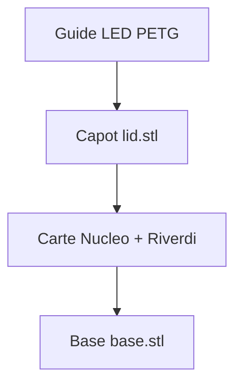

# Boitier NUCLEO-U5A5ZJ-Q + Riverdi (ferme, sans aeration)

Ce dossier contient un design parametrique OpenSCAD pour un boitier ferme, imprimable FDM,
avec:

- acces aux 2 connecteurs USB
- ouverture ecran
- acces boutons reset/controle
- points de fixation de la carte Nucleo (standoffs)
- fermeture base/capot par vis M2
- guide lumineux PETG translucide pour la LED de status

## Fichiers

- `parameters.scad`: toutes les cotes a ajuster
- `case_parts.scad`: geometrie complete
- `export_base.scad`: export STL base
- `export_lid.scad`: export STL capot
- `export_light_pipe.scad`: export STL guide LED
- `MANUEL_ASSEMBLAGE.md`: procedure complete d'assemblage + schemas illustratifs + visserie

## Export STL

Si OpenSCAD CLI est installe:

```bash
openscad -o base.stl export_base.scad
openscad -o lid.stl export_lid.scad
openscad -o light_pipe_petg.stl export_light_pipe.scad
```

## Reglages importants avant impression

1. Verifier les dimensions board:
   - `board_len`, `board_wid`
2. Verifier les positions des 4 trous de fixation:
   - `mount_hole_offset_x`, `mount_hole_offset_y`
3. Verifier positions USB:
   - `usb1_y`, `usb1_z`, `usb2_y`, `usb2_z`
4. Verifier ouverture ecran:
   - `screen_center_x`, `screen_center_y`, `screen_open_len`, `screen_open_wid`
5. Verifier positions boutons:
   - `btn1_x/y`, `btn2_x/y`, `btn3_x/y`
6. Verifier position LED:
   - `led_x`, `led_y`

## Materiel conseille

- Fermeture boitier: 4x vis M2 (longueur 8 a 12 mm selon tete)
- Inserts thermiques M2: OD typique 3.2 a 3.5 mm
- Fixation carte sur standoffs:
  - vis M2.5 (par defaut, trou standoff 2.8 mm)
  - ou adapter `standoff_screw_clear_d` pour M3

Pour les references precises de vis, longueurs et l'ordre de montage,
voir `MANUEL_ASSEMBLAGE.md`.

## Schemas rapides

### Vue eclatee



### Sequence d'assemblage


## Conseils impression BambuLab

- Base: orienter fond sur plateau
- Capot: orienter face externe sur plateau (ou inverser selon rendu voulu)
- Guide LED PETG translucide: imprimer vertical, flange sur plateau
- Buse 0.4 mm, couches 0.2 mm
- 4 perimetres, 25% infill gyroid
- Activer "detect thin walls" si besoin

## Notes

Le design est ferme (pas de grilles de ventilation).
